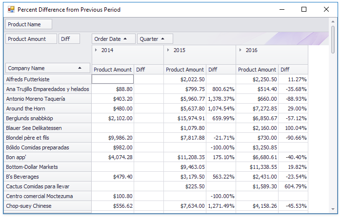

<!-- default badges list -->

<!-- default badges end -->
<!-- default file list -->
*Files to look at*:

* [Form1.cs](./CS/Percent_Difference_From_Previous_Period_Example/Form1.cs) (VB: [Form1.vb](./VB/Percent_Difference_From_Previous_Period_Example/Form1.vb))
<!-- default file list end -->
# How to Display a Percent Difference from the Previous Parallel Period

This example demonstrates how to display the difference between the value for the current year (quarter) and the value for the previous year (the same quarter of the previous year).

## API

* [PivotGridControl.CustomCellDisplayText](http://docs.devexpress.com/WindowsForms/DevExpress.XtraPivotGrid.PivotGridControl.CustomCellDisplayText) event
* [PivotCellDisplayTextEventArgs.GetCellValue](https://docs.devexpress.com/WPF/DevExpress.Xpf.PivotGrid.PivotCellBaseEventArgs.GetCellValue(System.Object---System.Object---DevExpress.Xpf.PivotGrid.PivotGridField)) method
* [PivotGridField.GetUniqueValues](https://docs.devexpress.com/CoreLibraries/DevExpress.XtraPivotGrid.PivotGridFieldBase.GetUniqueValues.overloads) method

## More Examples

* [How to Access a Different Cell's Value While Calculating the Value of the Current Cell](https://github.com/DevExpress-Examples/how-to-access-other-cell-value-while-calculating-the-current-cell-e1110)
